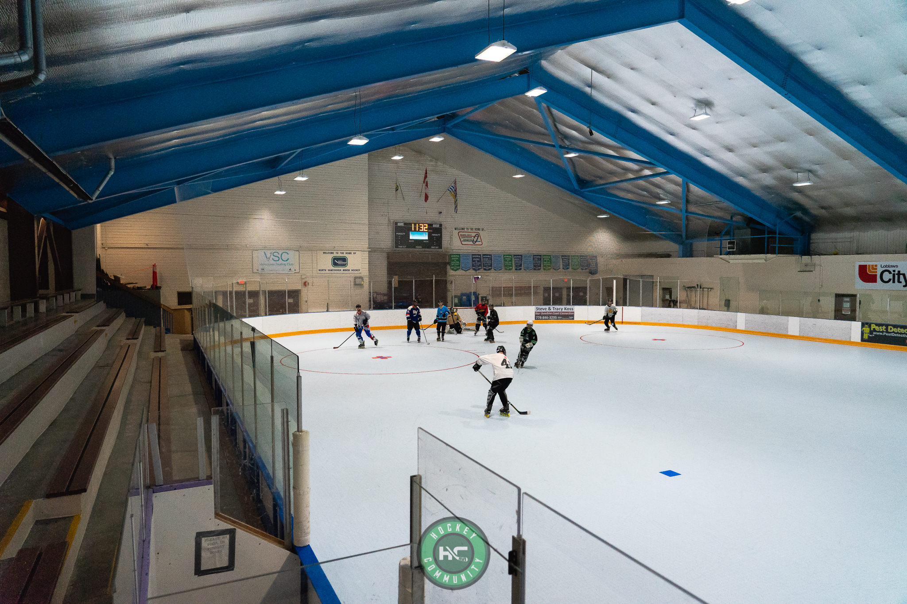
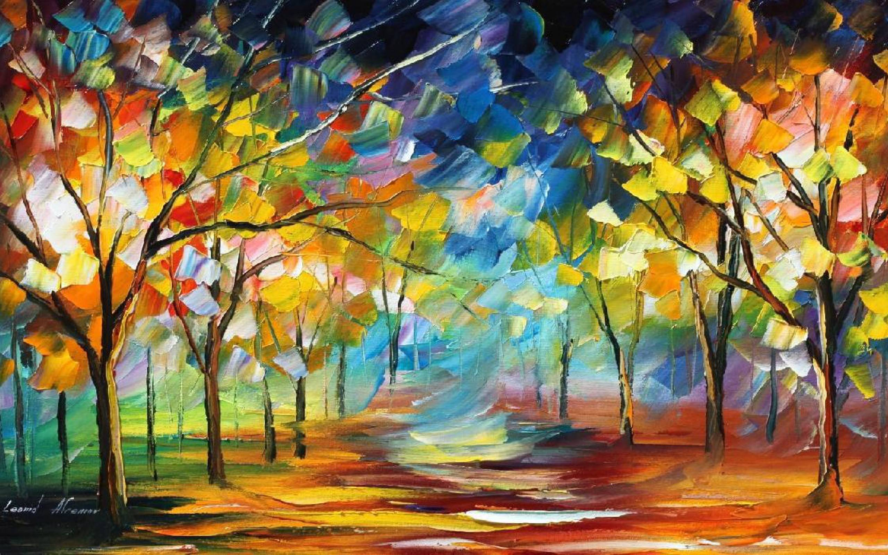
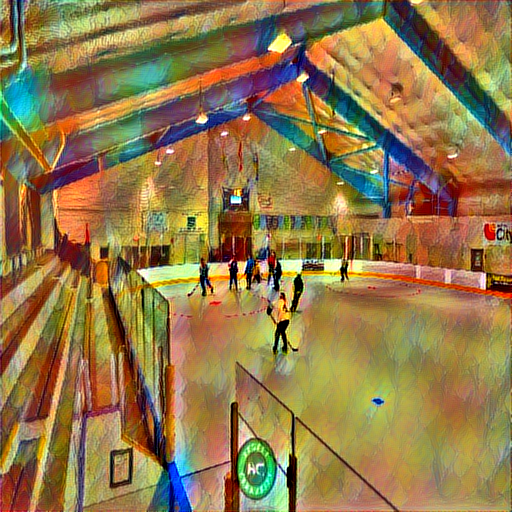

# Neural-Style-Transfer
Neural Style Transfer on TensorFlow
An implementation of neural style in TensorFlow.
Running it for 500-2000 iterations seems to produce nice results. With certain images or output sizes, you might need some hyperparameter tuning (especially --content-weight, --style-weight, and --learning-rate).

The following example was run for 1000 iterations to produce the result (with default parameters):

Original Image of ice hockey:

The art image I have used to transform the original image is:

The transformed image is:

